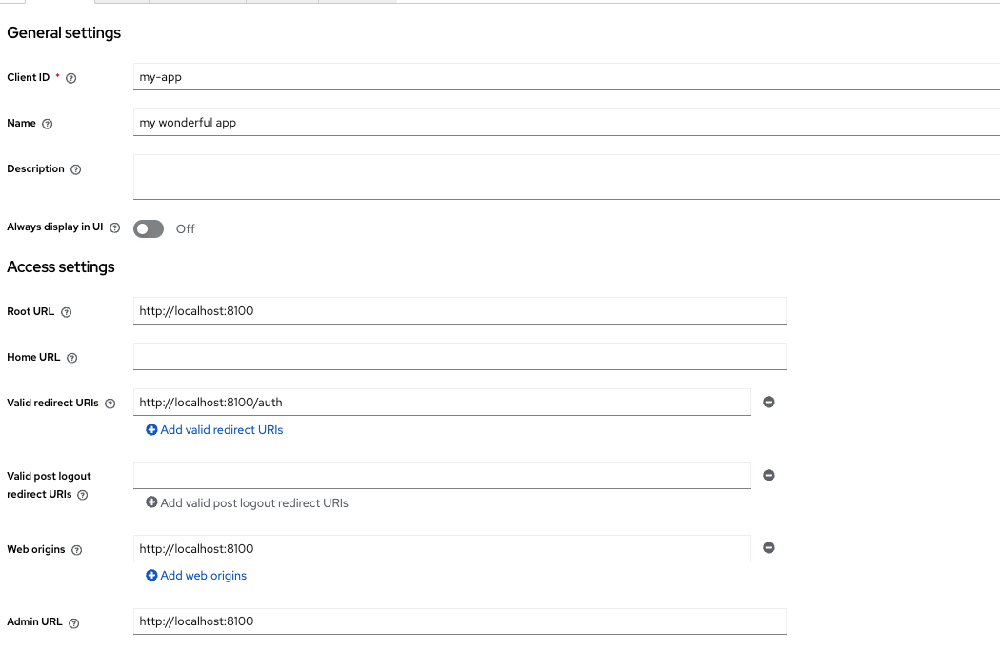

### Steps to set up Docker configuration locally

- **Initialize a local Docker volume to persist the Keycloak authorization server data.**
- **Start Postgres. Postgres will provide the backing store for Keycloak.**
- **Start pgAdmin so that we can inspect the PostgreSQL database.**
- **Start the Keycloak admin server.**

Your will need to run chmod +x *.sh in order to execute these scripts

You can do all of this by executing ./setup-docker.sh

### Credentials
pgadmin: admin@admin.com/admin
postgres: keycloak/keycloak
keycload admin console: admin/admin

### Configure Keycloak authorization server
